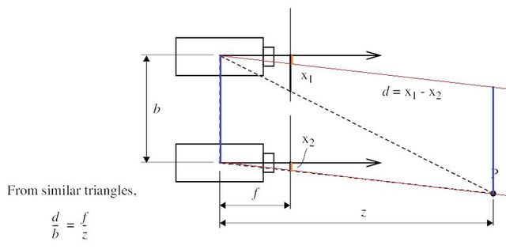

## Rectified Image Pair of Stereo Camera

구글 검색해서 나온 frame 에 보조선을 살짝 덧입혔다. 스테레오 카메라에서 양쪽 수평의 카메라를 calibration 을 통해 rectified image pair 를 얻어내는 상황이라고 가정하자. opencv 의 stereoCalibrate, stereoRectifify 같은 함수들을 찾아보면 된다.

Disparity 는 월드상의 점 P 가 양쪽 이미지에 대해서 pixel 좌표간의 거리이고,  우리는 이미 stereo calibration 을 통해 epipolar line 들이 양쪽 이미지에 대해서 모두 x축과 나란해진 상태로 맞춰놨기 때문에, 위 그림과 같이  $x1-x2$ 로 표현된다. 위 아래의 빨간색 직선 두개는 서로 수평이고, 오른쪽 왼쪽의 파란색 직선 두개도 서로 수평이다. 또한 $x2$ 의 길이와 같은 선분을 오렌지색으로 소심하게 표현하였다. 즉 오른쪽 파란선의 길이도 baseline (두 카메라가 벌어진 거리 in real metric) 과 동일하고 위쪽 카메라부분에서  $x1-x2$  가 어느 부분인지 확인할 수 있다. 이때 위쪽 카메라에서 오른쪽으로 뻣어나가는 삼각형을 봤을때 

$$
f : x1-x2 = z : b
$$

인 것을 알 수 있다. 즉 $z = f * b / d$ 임을 알 수 있다.